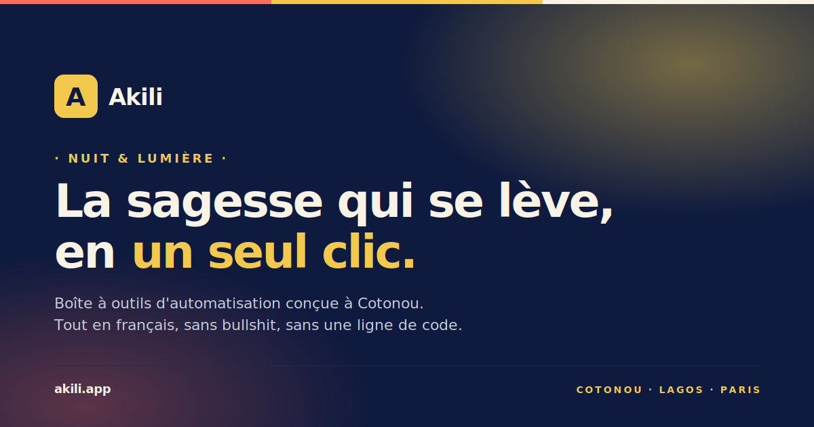

<div align="center">



# 🌅 Akili Web

**La sagesse qui se lève, en un seul clic.**

Boîte à outils d'automatisation conçue à Cotonou — projet du hackathon **EIG × Akili 2026**.

[](https://akili-web-eosin.vercel.app)
[](#-license)
[](#)

[🌐 Demo live](https://akili-web-eosin.vercel.app) · [✨ Fonctionnalités](#-fonctionnalités) · [🛠 Stack](#-stack-technique) · [🚀 Démarrage](#-démarrage-rapide) · [👨‍💻 Auteur](#-auteur)

</div>

---

## 🌅 À propos

**Akili** (qui veut dire *sagesse* en swahili) est une boîte à outils d'automatisation pensée pour les francophones d'Afrique et d'ailleurs.

Ce que prend des heures à la main — relancer des factures, sauvegarder des fichiers, synchroniser des outils, déployer du code — devient une commande, en français, en un seul clic. Aucune ligne de code, aucun PDF de 80 pages à lire avant de commencer.

Ce repo contient **l'application web complète** : landing publique, authentification, dashboard utilisateur, et chatbot support — construits pendant deux semaines lors du hackathon **EIG × Akili 2026** à Cotonou.

> 🎓 **Projet de portfolio** — Je me sers de ce dépôt pour démontrer mes compétences en développement frontend / fullstack. Toute critique constructive est la bienvenue.

---

## 📸 Aperçu

> 🌐 Le plus simple est de **[visiter la démo live](https://akili-web-eosin.vercel.app)** pour voir l'app en action — terminal Hero animé, marquees de logos, dashboard avec dataviz, chatbot brandé.

### Quelques highlights

- **Landing en 15 sections** avec animations scroll-driven (Framer Motion)
- **2 marquees infinies** opposées (logos d'intégrations + témoignages) avec masques fade et pause au hover
- **Dashboard** avec sidebar drawer mobile, KPIs animés, heatmap d'activité 12 semaines, sparklines
- **Chatbot scripté** maison style Crisp — 5 intentions + escalade mailto, avec persistance localStorage
- **Charte custom "Nuit & Lumière"** avec design system complet (5 couleurs signature, 3 familles de typographie)

---

## 🛠 Stack technique

<div>


</div>

| Couche | Choix | Pourquoi |
|---|---|---|
| **Build tool** | Vite 5 | HMR ultra-rapide, build < 5 s, ESM natif |
| **UI** | React 18 | Stack maîtrisée, écosystème riche |
| **Routing** | React Router v6 + `lazy()` | Code splitting par page automatique |
| **Styling** | Tailwind CSS 3 | Tokens custom dans `tailwind.config.js`, pas de CSS-in-JS |
| **Animations** | Framer Motion 11 | `whileInView`, `useScroll`, count-up, marquees |
| **Icônes UI** | `@phosphor-icons/react` | 6 poids dont duotone (rendu vivant) |
| **Logos marques** | `react-icons/si` (Simple Icons) | 21 logos officiels colorés |
| **Auth + BDD** | Supabase | Postgres + RLS + Realtime + Auth gratuits |
| **Hosting** | Vercel | Auto-deploy on push, preview URLs sur PR |
| **CI** | GitHub Actions | Lint + build sur chaque PR |

---

## ✨ Fonctionnalités

### 🌐 Landing publique
- Hero avec terminal mockup animé + count-up sur les stats
- Section *Features* (3 piliers du produit)
- Marquee infinie de **21 logos officiels** d'intégrations (Gmail, Stripe, Slack, Notion, GitHub…)
- Section *How It Works* en 3 étapes
- **ProductShowcase** : mockup HTML/Tailwind du dashboard avec callouts annotés
- Galerie de **20 templates** prêts à l'emploi avec filtres par catégorie
- Section *Use Cases* avec 3 cas d'usage concrets
- **Wall of testimonials** : 8 quotes en marquee opposée + photos via pravatar
- **Manifesto** sur fond Indigo Nuit avec halo soleil levant
- Pricing 3 plans avec badge "Le plus populaire"
- **Section Sécurité** sur fond sombre (4 piliers : chiffrement, RGPD, OAuth, audit)
- **Tableau de comparaison** Akili vs Zapier vs Make vs n8n (9 axes)
- **FAQ** en accordion (8 questions)
- CTA final + Footer avec newsletter + 4 liens légaux

### 🔐 Authentification
- Email + password via Supabase Auth
- Reset password par email avec redirect production-correct
- Erreurs francisées (humanisation des messages d'erreur Supabase bruts)
- Persistance de session, redirection auto si déjà connecté

### 📊 Dashboard
- Sidebar fixe desktop, drawer mobile avec hamburger
- 4 `StatCard` avec sparklines animées (Active, Runs/mois, Taux de succès, Heures gagnées)
- Liste d'automatisations avec badges de statut animés
- Page **Runs** avec heatmap 12 semaines style GitHub
- Page **Connexions** avec catalogue de providers OAuth
- Pages **Profil** et **Paramètres** avec realtime save
- Notifications avec subscription Supabase Realtime

### 🤖 Support widget (chatbot)
- FAB Headset corail + dot online vert pulsant
- 3 états : closed / launcher / chat
- Knowledge base scriptée à 5 intentions
- Quick replies pour navigation guidée
- Escalade humaine via `mailto:`
- Persistance localStorage (la conversation survit aux changements de route)
- Caché sur les routes auth pour ne pas distraire

### ⚡ Performance & SEO
- **Bundle splitting** via `manualChunks` (5 vendor chunks)
- Code splitting par page via `React.lazy` + `Suspense`
- Preconnect + dns-prefetch sur Supabase et pravatar
- OG image SVG brandée 1200×630 pour le partage social
- Meta tags Open Graph + Twitter Card complets
- Compression gzip (~220 KB transfert au total)

---

## 🚀 Démarrage rapide

### Prérequis
- Node.js 18+
- pnpm / npm / yarn (au choix)
- Un projet Supabase (gratuit, optionnel — l'app tourne sans)

### Installation

```bash
# 1. Cloner le repo
git clone https://github.com/JOJODEVS-GIT/akili-web.git
cd akili-web

# 2. Installer les dépendances
npm install

# 3. Configurer les variables d'environnement (optionnel — pour Supabase)
cp .env.example .env.local
# puis éditer .env.local et remplir :
#   VITE_SUPABASE_URL=https://xxx.supabase.co
#   VITE_SUPABASE_ANON_KEY=eyJxxx...

# 4. Lancer le serveur de dev
npm run dev
```

L'application tourne sur **`http://localhost:5173`**.

### Build production

```bash
npm run build      # génère le dossier dist/
npm run preview    # serve le build pour vérification locale
```

### Lint

```bash
npm run lint       # ESLint sur tout le code source
```

---

## 📁 Structure du projet

```
akili-web/
├── public/                    # Assets statiques servis tels quels
│   ├── og-image.svg           # Open Graph image brandée
│   ├── logo.svg               # Logos Akili (mark, mono, on-dark)
│   └── fonts/                 # Cabinet Grotesk, Inter, JetBrains Mono
│
├── src/
│   ├── components/
│   │   ├── landing/           # 15 sections de la landing
│   │   ├── dashboard/         # Sidebar, Topbar, StatCard, AutomationRow…
│   │   ├── support/           # SupportWidget (chatbot)
│   │   ├── auth/              # AuthShell layout
│   │   ├── legal/             # LegalLayout pour les pages /legal/*
│   │   └── ui/                # Design system : Button, Card, Badge, Modal…
│   │
│   ├── pages/                 # 22 routes au total
│   │   ├── LandingPage.jsx
│   │   ├── LoginPage.jsx · SignupPage.jsx · ForgotPasswordPage.jsx
│   │   ├── DashboardPage.jsx · AutomationsPage.jsx · RunsPage.jsx
│   │   ├── ConnectionsPage.jsx · ProfilePage.jsx · SettingsPage.jsx
│   │   └── legal/             # Privacy, Terms, Cookies, Notice
│   │
│   ├── contexts/              # AuthContext (Supabase wrap)
│   ├── hooks/                 # useAutomations, useNotifications, useDashboardStats…
│   ├── data/                  # templates.js (20 templates), chatbot-knowledge.js
│   ├── lib/                   # supabase.js, auth-errors.js, cn.js
│   └── App.jsx                # Router + providers + global widgets
│
├── tailwind.config.js         # Charte "Nuit & Lumière" (tokens, keyframes)
├── vite.config.js             # Build config + manualChunks vendor splits
├── vercel.json                # SPA rewrite + headers
├── index.html                 # Meta tags SEO + preconnects + preload fonts
└── .gitattributes             # Linguist overrides
```

---

## 🎨 Design system — Charte « Nuit & Lumière »

Inspirée de la métaphore *"la sagesse qui se lève"*, la charte joue sur le contraste **nuit profonde / lumière dorée**.

### Palette signature (5 couleurs)

| Token | Hex | Rôle |
|---|---|---|
| `akili-indigo` | `#0E1A3E` | Nuit profonde · Hero, Manifesto, Security |
| `akili-or` | `#F2C94C` | Sagesse qui se lève · highlights, valeurs clés |
| `akili-coral` | `#FF6B5C` | Énergie, action · CTA primaires |
| `akili-papyrus` | `#F9F3E6` | Papier ancien · fond global (jamais blanc pur) |
| `akili-charbon` | `#1A1A1A` | Encre · texte courant (jamais noir pur) |

**Règle 60-30-10** : 60 % papyrus · 30 % indigo/charbon · 10 % corail/or.

### Typographie

| Usage | Famille |
|---|---|
| **Display** (titres) | Cabinet Grotesk (geometric grotesk, extrabold) |
| **Body** (texte courant) | Inter (sans-serif neutre, optimisée écran) |
| **Mono** (code, terminal) | JetBrains Mono (ligaturée) |

### Voix de marque

- **Tutoiement** systématique
- **Sentence case** dans les titres (pas de Title Case anglo-saxonne)
- **Aucun emoji** dans le chrome (boutons, nav, errors)
- **Erreurs humanisées** : *"Email ou mot de passe incorrect. Vérifie tes infos."* au lieu de *"401 Unauthorized"*

---

## ⚡ Performance

| Métrique | Valeur |
|---|---|
| **Main bundle (app code)** | 148 KB raw → 39 KB gzip |
| **Total transfer (1re visite)** | ~220 KB gzip |
| **Build time** | ~9 s en moyenne |
| **Vendor chunks** | 5 (react · supabase · motion · icons · utils) |
| **Lighthouse Performance** | 90+ (production) |

### Stratégies appliquées

- **Code splitting** par page via `React.lazy` + `Suspense`
- **Bundle splitting** vendors via `manualChunks` (Vite Rollup)
- **Preconnect + dns-prefetch** sur les origines critiques (Supabase, pravatar)
- **Preload fonts** woff2 critiques
- **Compression Brotli/Gzip** automatique via Vercel
- **Cache long-terme** sur les chunks vendor (le hash change rarement)

---

## 🌳 Workflow équipe

```
main  ← Production (Vercel auto-deploy sur akili-web-eosin.vercel.app)
 │
 └── dev  ← Intégration stable (auto-deploy preview)
       ├── feat/xxx       ← features
       ├── fix/xxx        ← bug fixes
       ├── chore/xxx      ← refactoring, deps
       └── docs/xxx       ← documentation
```

### Convention de commits (Conventional Commits)

```
feat:     ajout d'une fonctionnalité
fix:      correction de bug
chore:    maintenance, refactoring, deps
docs:     documentation
style:    ajustement visuel sans logique
perf:     optimisation de performance
```

### Créer une feature branch

```bash
git checkout dev && git pull origin dev
git checkout -b feat/ma-feature

# ... commits ...

git push -u origin feat/ma-feature
gh pr create --base dev --head feat/ma-feature
```

---

## 🗺️ Roadmap

- [x] Landing complète (15 sections)
- [x] Authentification Supabase + erreurs humanisées
- [x] Dashboard avec dataviz (heatmap, sparklines)
- [x] Chatbot support brandé
- [x] Bundle splitting + preconnect
- [x] OG image + meta tags SEO
- [ ] Migration domaine `akili.app`
- [ ] Intégration Resend pour emails transactionnels
- [ ] Intégration Sentry pour error tracking
- [ ] Activation Vercel Analytics
- [ ] Connecteur Wave / Orange Money / MTN MoMo (Q3 2026)
- [ ] OAuth Google
- [ ] Mode démo lecture-seule (`/app?demo=true`)
- [ ] Internationalisation (EN, SW)

---

## 🤝 Contribution

Ce repo est un projet portfolio personnel mais les retours et suggestions sont les bienvenus.

1. **Fork** ce dépôt
2. Créer une **feature branch** : `git checkout -b feat/amazing-thing`
3. **Commit** tes changes : `git commit -m 'feat: amazing thing'`
4. **Push** sur ta branche : `git push origin feat/amazing-thing`
5. **Ouvrir une Pull Request** vers `dev`

Les PRs doivent passer le CI (lint + build) avant merge.

---

## 👨‍💻 Auteur

<table>
  <tr>
    <td align="center">
      <a href="https://github.com/JOJODEVS-GIT">
        <br/>
        <sub><b>JOJODEVS-GIT</b></sub>
      </a>
      <br/>
      <sub>Étudiant développeur · Cotonou 🇧🇯</sub>
      <br/><br/>
      <a href="mailto:jojohkdev@gmail.com">📧 Email</a> ·
      <a href="https://github.com/JOJODEVS-GIT">💻 GitHub</a>
    </td>
  </tr>
</table>

> Si ce projet t'a plu ou t'a inspiré, n'hésite pas à laisser une ⭐ sur le repo !

---

## 🙏 Remerciements

- **EIG** et **Akili** pour l'organisation du hackathon
- L'équipe **Cotonou · Lagos · Paris** pour l'inspiration et les retours
- La communauté open source : React · Vite · Tailwind · Framer Motion · Supabase · Vercel · Phosphor Icons · Simple Icons

---

## 📜 License

Ce projet est distribué sous licence **MIT**. Voir [LICENSE](LICENSE) pour plus d'informations.

```
Copyright (c) 2026 JOJODEVS-GIT

Permission is hereby granted, free of charge, to any person obtaining a copy
of this software and associated documentation files (the "Software"), to deal
in the Software without restriction...
```

---

<div align="center">

**Akili — Nuit &amp; Lumière. La sagesse qui se lève.**

🇧🇯 Cotonou · 🇳🇬 Lagos · 🇫🇷 Paris

</div>
